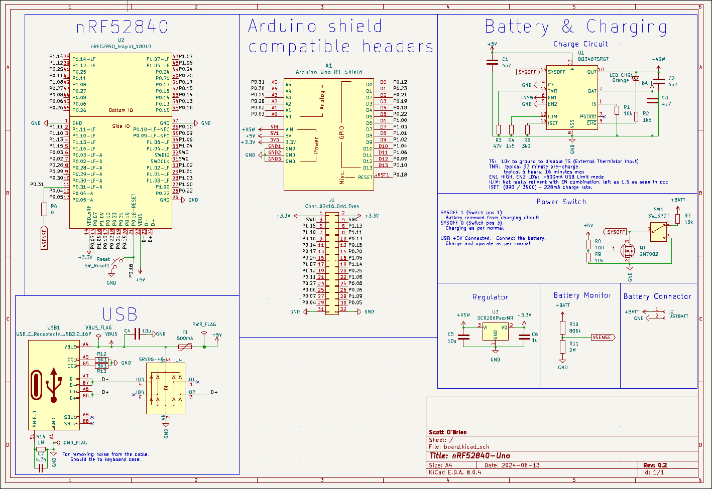
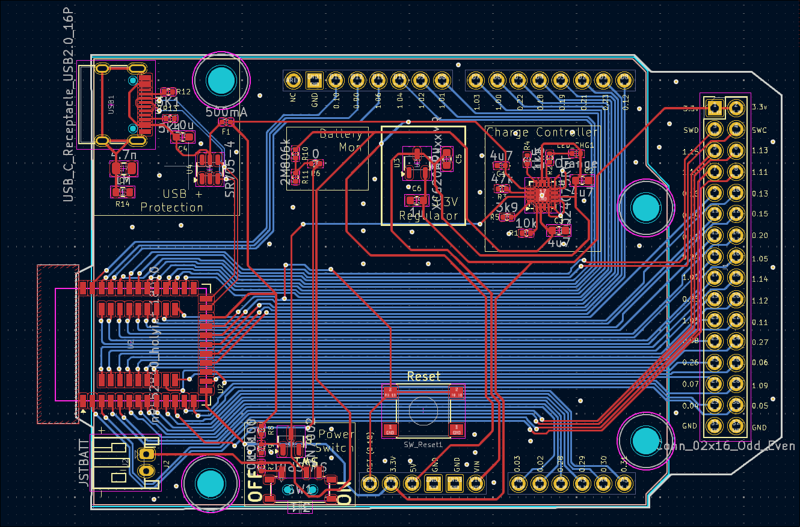

# nrf52840-uno
A development board for the nRF52840 in a Uno form factor.  Idea is to test nRF52 components before using on larger projects.  Has USB-C support
and a LiPo charge controller.

Using the Holyiot 18010 module due to not wanting to have the know-how of antenna design just yet!

## Battery

Please ensure that a 1S LiPo battery is used with at least a capacity of 450mA (or ability to charge at a rate of 450mA)

## Flashing

Something like the Adafruit Pogo probe (4 pin version), can be used to flash this using SWD.  I used a rPi Pico and [DebugProbe](https://github.com/raspberrypi/debugprobe)

**Quickstart:**
```
openocd -f interface/cmsis-dap.cfg -f target/nrf52.cfg -c "init"
[scott@sob-desktop Adafruit_Adalink]$ openocd -f interface/cmsis-dap.cfg -f target/nrf52.cfg -c "init"
Open On-Chip Debugger 0.12.0
Licensed under GNU GPL v2
For bug reports, read
	http://openocd.org/doc/doxygen/bugs.html
Info : auto-selecting first available session transport "swd". To override use 'transport select <transport>'.
Info : Using CMSIS-DAPv2 interface with VID:PID=0x2e8a:0x000c, serial=E66130100F7FA32B
Info : CMSIS-DAP: SWD supported
Info : CMSIS-DAP: Atomic commands supported
Info : CMSIS-DAP: Test domain timer supported
Info : CMSIS-DAP: FW Version = 2.0.0
Info : CMSIS-DAP: Interface Initialised (SWD)
Info : SWCLK/TCK = 0 SWDIO/TMS = 0 TDI = 0 TDO = 0 nTRST = 0 nRESET = 0
Info : CMSIS-DAP: Interface ready
Info : clock speed 1000 kHz
Info : SWD DPIDR 0x2ba01477
Info : [nrf52.cpu] Cortex-M4 r0p1 processor detected
Info : [nrf52.cpu] target has 6 breakpoints, 4 watchpoints
Info : starting gdb server for nrf52.cpu on 3333
Info : Listening on port 3333 for gdb connections
Info : Listening on port 6666 for tcl connections
Info : Listening on port 4444 for telnet connections

(seperate terminal)
(env) [scott@sob-desktop local-scott]$ telnet localhost 4444
Trying ::1...
telnet: connect to address ::1: Connection refused
Trying 127.0.0.1...
Connected to localhost.
Escape character is '^]'.
Open On-Chip Debugger
> nrf5 info
nRF52840-xxAA(build code: D0) 1024kB Flash, 256kB RAM

halt
nrf5 mass_erase
flash write_image pca10056_bootloader-0.2.11_s140_6.1.1.hex
flash verify_image pca10056_bootloader-0.2.11_s140_6.1.1.hex
reset run

```

Programming with Arduino:
```
Adafruit mRF52 -> Nordic nRF52840 DK (ours is similar to this)
Tools -> Programmer -> Bootloader DFU
Burn Bootloader
```



