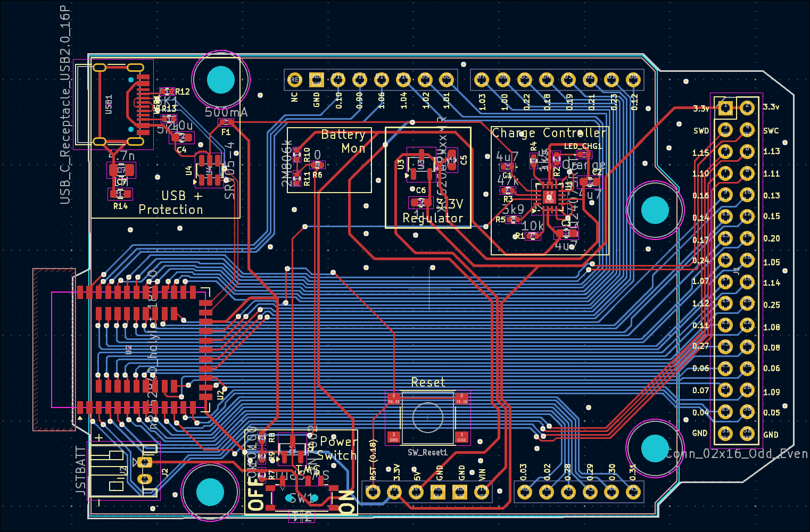

# nrf52840-uno
A development board for the nRF52840 in a Uno form factor.  Idea is to test nRF52 components before using on larger projects.

Using the Holyiot 18010 module due to not wanting to have the know-how of antenna design
just yet!

